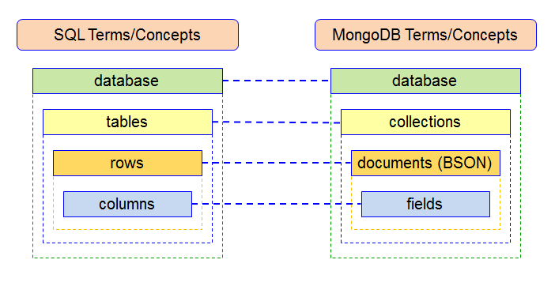

[](https://generalassemb.ly/education/web-development-immersive)
## SEIR712 September 13, 2021
# SQL

It's time to learn our second database format! SQL is an older form of database
management. Despite its age, it's still one of the most common and popular
forms of data storage in building web applications - we're going to use it as our DB when
we start learning Django! SQL stands for structured query language, the programming infrastructure used for retrieving data from relational databases. 

## Prerequisites

- None!

## Objectives

By the end of this lecture, developers should be able to:

- Contrast relational and non-relational databases
- Create, set up, and seed a PostgreSQL database.
- Execute SQL commands to perform CRUD actions.
- Describe how to represent relationships in SQL databases
- Use JOIN to combine tables in a SELECT

## Introduction

Today we are going to introduce a new (but very old) paradigm for persisting
data in our applications. Previously, we have used MongoDB as our database when
building node applications. In fact, there are many alternatives. In this lesson
we will contrast PostgreSQL, a relational database, with MongoDB, a
non-relational database.

## What is a Relational Database? 

Here's the super dense technical definition. Not required for understanding how
it works unless you want to dive extremely deeply.

> The relational model (RM) for database management is an approach to managing
> data using a structure and language consistent with first-order predicate
> logic, first described in 1969 by Edgar F. Codd, where all data is represented
> in terms of tuples, grouped into relations. A database organized in terms of
> the relational model is a relational database.

- https://en.wikipedia.org/wiki/Relational_model
- https://en.wikipedia.org/wiki/Relation_(database)

What it doesn't mean: That the database has the ability to relate one
value/collection/document to another. All databases (should) have that ability.
In MongoDB, we can use refs or directly embed schemas into other schemas.

It does mean: data is stored using the _relational model_ in mathematics.

Key takeaway: the way data is organized is fundamentally different in a RDB than
in a non-relational DB (also called noSQL sometimes).

### Lets Talk Terminology



**Database:** The actual set of data being stored

- We may have multiple databases for an application

**Database Language:** The language used to interact with a database

- With relational databases, we use SQL
- There isn't a standard language across noSQL databases

> What language do we use to interface with MongoDB?

**Database Management System (DBMS):** The software that lets a user interact
(query) the data in a database

- Relational examples include PostgreSQL and MySQL
- Nonrelational include MongoDB, Redis, CouchDB

**Database CLI:** A tool offered by most DBMSs that allow users to query the
database from the command line

- We will use one called `psql` for PostgreSQL
- **What was the MongoDB equivalent?**

## Relational vs Non-Relational | PostgreSQL vs MongoDB 

Non-Relational or **noSQL** databases have existed in some form for decades,
however their use didn't become wide spread until recently. noSQL databases
became an important alternative to relational databases in the early 2000s as
internet tech companies' data storage needs changed and expanded. With the rise
of social media and online marketplaces like eBay, the amount of data on the
internet boomed. Users were not only getting information from the internet, they
were contributing to it. This transition stressed the capabilities of relational
databases due to the volume and variability of user-generated data.

noSQL databases **generally** offer more flexibility and scalability than
traditional relational databases. However, they come with the cost of reduced
consistency.

### MongoDB is non-relational (noSQL)

MongoDB is document-based. Meaning, data is organized in collections of related
documents formatted in JSON.

#### Key Advantages of NoSQL

##### Usability

- Documents (i.e. JSON objects) correspond to native data types in many
  programming languages (like mongo + JSON)
- Documents can contain data that varies or is incomplete, no need for
  migrations

##### High Performance

- Documents can be embedded in one another reducing the need for joins.
- Simple queries are very fast

### PostgreSQL is relational (SQL)

PostgreSQL is a relational database management system. There are many others
like MySQL, MS SQL, Oracle, and sqlite. They are all queried using SQL.

#### Key Advantages of SQL

##### Consistency

- A lot of data is tabular already, relational databases store it in a similar
  form
- Schemas mean you know exactly what attributes (columns) for each database
  entry (row)
- Schemas can check the type of data being stored to ensure data coming in is
  properly formatted and consistent with other entries.
- Writes to a database follow ACID paradigm (atomicity, consistency, isolation,
  durability). More about [ACID](https://en.wikipedia.org/wiki/ACID)

##### SQL Dialect

- SQL is used in most relational databases meaning interaction across different
  relational DBMS is very similar
- SQL is well documented and extremely robust in its utility
- SQL queries are a powerful tool to quickly retrieve data in a large variety of
  ways.

#### Both offer:

##### Automatic Scaling

- Sharding distributes data across a cluster of servers (data can be broken up across different remote hosts)
- Replica sets provide low-latency high-throughput deployments (multiple data sets provide redundancy and allow for rapid updating)

### Further Reading: SQL vs. NOSQL

Read the following [article](https://dev.to/jacobjzhang/a-beginner-s-reference-to-sql-vs-nosql-egk) on Relational vs. Nonrelational databases. Consider the following questions: 

1. How would you define relational databases? List an example of one.
2. How would you define nonrelational databases? List an example of one.
3. What use cases would be optimal for SQL and NOSQL databases? 
4. Which do you think is better? Why?

## Data Compared: Collections (MongoDB) vs. Tables (PostgreSQL)

Within a MongoDB database (NOSQL or nonrelational), our data is organized in collections of JSON-like objects, called documents. Here's an example collection:

```js
[
  {
    artistName: "Funkadelic",
    nationality: "American",
    songs: [
      {
        name: "Cosmic Slop",
        yearReleased: 1976
      },
      {
        name: "Free Your Mind",
        yearReleased: 1970
      }
    ]
  },
  {
    artistName: "Paul McCartney",
    nationality: "British",
    songs: [
      {
        name: "Heart of the Country",
        yearReleased: 1970
      },
      {
        name: "Band on the Run",
        yearReleased: 1973
      }
    ]
  }
]
```

In a relational (SQL) database, this data would be stored in two separate tables.

**artists**

| id  | name           | nationality |
| --- | -------------- | ----------- |
| 1   | Funkadelic         | American    |
| 2   | Paul McCartney | British     |

**songs**

| id  | name                | year_released | artist_id |
| --- | ------------------- | ------------- | --------- |
| 1   | Heart of the Country         | 1970          | 2         |
| 2   | Cosmic Slop | 1976          | 1         |
| 3   | Free Your Mind     | 1970          | 1         |
| 4   | Band on the Run         | 1973          | 2         |

See also: [Naming style guide](http://www.sqlstyle.guide/).

Note: there's no definitive naming convention for SQL databases. It's far more
important to be consistent across your db. More are in the "plural table names and
singular column names" camp. 

- What are the advantages of each structure? 
- What might be some disadvantages of each structure? 

## Now Let's Try Out PostgreSQL! 

### Lecture Objectives: 
* Contrast relational and non-relational databases. ✅
* Create, set up, and seed a PostgreSQL database. 👈
* Execute SQL commands to perform CRUD actions.
* Describe how to represent relationships in SQL databases.
* Use JOIN to combine tables in a SELECT.

### Make sure Postgres is installed

We installed Postgres during [Installfest](https://git.generalassemb.ly/sei-921/installfest/blob/master/postgres.md) in Week 1! Follow the commands below to ensure that it is running. 

1. Open a terminal window. 
1. Type `brew services list`. You should see a service called `postgresql` with a green status of "started". 
1. If it says started in yellow, run `brew services restart postgres` to restart your PostgreSQL server. 
1. If it says stopped in red, run `brew services start postgres` to start the server.

> On Linux use `service postgresql status` to check that Postgres is running. Postgres will only work if you see a green circle and the words "active (running)" somewhere in the output.


## Exploring Postgres CLI 


## Schema 

Every application's database will have one or more tables. You will recall, each
table stores information about a particular model (e.g., `artists`, `songs`).

Each table has a **schema**, which defines and enforces what columns it has. For
each column the schema defines...

- The column's name
- the column's data type
- Any constraints for that column

### Common Data Types

Here are some common data types for SQL databases. They are all, for the most
part, things you've seen before...

- boolean
- integer
- float
- text / VARCHAR
  - VARCHAR can be of variable length, TEXT is unlimited
- date
- time

> [And many more...](https://www.postgresql.org/docs/9.5/static/datatype.html)

### Constraints

Constraints act as limits on the data that can go in a column.

- e.g., `NOT NULL` and `UNIQUE`

> [And many more...](https://www.postgresql.org/docs/9.5/static/ddl-constraints.html)

### Defining a Schema

Next we're going to build a schema for a database in a sample application. It
can change later on if we need to add / remove tables or columns, but we'll
start with something simple.

Instead of typing this into `psql`, you can write to a `.sql` file and run it,
just like we have with `.js` and `.rb` files.### psql commands

We'll use the `psql` command as our primary means of interacting with our
databases. This is our CLI. Later on we'll use Python or server-side Javascript
to do so in our programs.

Type `psql` with no arguments to connect to a database with the same name as
your username.

Type `psql -d <dbname>` to connect to a specific database. There's usually a
database that already exists called `postgres` so you can type
`psql -d postgres`.

Here's a quick demo. You may choose to code along or just watch! 

```sql
help -- general help
\?   -- help with psql commands
\h   -- help with SQL commands
\l   -- Lists all databases
\q   -- exits psql
q    -- exits a psql list or dialogue

CREATE DATABASE generalassembly; -- Don't forget the semicolon!
\l -- What changed?

\c generalassembly -- Connect to generalassembly database

\d -- Lists all tables

-> Lets go over these terms as we put them into the Command Line

CREATE TABLE students (
  id SERIAL PRIMARY KEY,
  first_name VARCHAR NOT NULL,
  last_name VARCHAR NOT NULL,
  quote TEXT,
  birthday VARCHAR,
  ssn INT NOT NULL UNIQUE
); -- Here we are defining a schema. More on this in just a bit...

\d

SELECT * FROM students;

INSERT INTO students (first_name, last_name) VALUES ('Jeremy', 'Taubman');
-- This won't work!

INSERT INTO students (first_name, last_name, quote, birthday, ssn) VALUES ('Jeremy', 'Taubman', 'Two goldfish are in a tank. One says, "Know how to drive this thing?"', 'January 6', 8675309);
SELECT * FROM students;

UPDATE students SET first_name = 'Will' WHERE first_name = 'Jeremy';
SELECT * FROM students;

DELETE FROM students WHERE first_name = 'Will';
DELETE FROM students WHERE first_name = 'Jeremy';

SELECT * FROM students;

DROP TABLE students; -- "drop" means to delete an entire table or database

\d

DROP DATABASE generalassembly;

\q --quits
```

In short...

- Backslash commands (e.g. `\l` ) are commands to navigate psql. These are
  psql-specific.
- Everything else is SQL. The SQL is what actually runs commands & interacts
  with the database.
- SQL can be verbose, so you can write multiple lines in the terminal. Make sure
  you terminate your command with `;` always.

> If you're curious as to where exactly your databases are being stored locally,
> enter `SHOW data_directory;` while in psql.

### SQL Syntax

- Whitespace doesn't matter (unless it splits up a word)
- Case sensitive for values (tables, columns, etc), but not commands (select,
  insert, drop).
- Always use single quotes when typing out string values
- Example style guide [here](http://www.sqlstyle.guide/)

```sql
-- gets all values from a table
SELECT * FROM table_name;

-- gets two columns from a table
SELECT column_name, other_column FROM table_name;

-- gets two columns from a table if a certain critera is true
SELECT column_name, other_column FROM table_name WHERE some_value > 100;

-- gets two columns from a table if a certain critera is true, only returning 10 records, in descending order
SELECT column_name, other_column FROM table_name WHERE value > 100 LIMIT 10 ORDER BY DESC ;
```


## We Do: Building Our Database & Basic Queries 

Clone down and follow the instructions in the
[library SQL Exercise repo](https://git.generalassemb.ly/sei-712/library_sql).

Complete the queries in `basic_queries.sql` in the library_sql repo. Do not go on to `advanced_queries` just yet. 

## Relationships in SQL / SQL JOINs 

### Lecture Objectives: 
* Contrast relational and non-relational databases. ✅
* Create, set up, and seed a PostgreSQL database. ✅
* Execute SQL commands to perform CRUD actions. ✅
* Describe how to represent relationships in SQL databases. 👈
* Use JOIN to combine tables in a SELECT.

One of the key features of relational databases is that they can represent
relationships between rows in different tables.

Going back to our library example, we have two tables: `books` and `authors`.
Our goal now is to somehow indicate the relationship between a book and an
author. In this case, that relationship indicates who wrote the book.

You can imagine that we'd like to use this information in a number of ways, such
as:

- Getting the author information for a given book
- Getting all books written by a given author
- Searching for books based on attributes of the author (e.g., all books written
  by a Chinese author)

#### Option 1 - Duplicate Info

**authors**

- name
- nationality
- birth_year

**books**

- title
- pub_date
- author_name
- author_nationality
- author_birth_year

<details>
  <summary><strong>What's the problem here?</strong></summary>

> Duplication, difficult to keep data in sync.

</details>

#### Option 2 - Array of IDs

**authors**

- name
- nationality
- book_ids

**books**

- title
- pub_date

<details>
  <summary><strong>What's the problem here?</strong></summary>

> Parsing list, can't index (for speed!)

</details>

#### Option 3

**authors**

- name
- nationality

**books**

- title
- pub_date
- author_id


## Joins

### Lecture Objectives: 
* Contrast relational and non-relational databases. ✅
* Create, set up, and seed a PostgreSQL database. ✅
* Execute SQL commands to perform CRUD actions. ✅
* Describe how to represent relationships in SQL databases. ✅
* Use JOIN to combine tables in a SELECT. 👈

To `SELECT` information on two or more tables at ones, we can use a `JOIN`
clause. This will produce rows that contain information from both tables. When
joining two or more tables, we have to tell the database how to match up the
rows. (e.g. to make sure the author information is correct for each book).

This is done using the `ON` clause, which specifies which properties to match.

### Writing SQL JOINS

```sql
SELECT id FROM authors where name = 'J.K. Rowling';
SELECT * FROM books where author_id = 2;

SELECT * FROM books JOIN authors ON books.author_id = authors.id;
SELECT * FROM books JOIN authors ON books.author_id = authors.id WHERE authors.nationality = 'United States of America';
```

## You Do: Books and Authors 

See advanced_queries.sql in the
[library_sql](https://git.generalassemb.ly/sei-921/library_sql/blob/master/advanced_queries.sql)
exercise.

## Hungry for More? Less Common Joins

There are actually a number of ways to join multiple tables with `JOIN`, if
you're really curious, check out this article:

[A visual explanation of SQL Joins](http://blog.codinghorror.com/a-visual-explanation-of-sql-joins/)

## Bonus: Many-to-Many Relationships

We're not going to go in-depth with many-to-many relationships today, but lets
go over a simple example:

Consider if we wanted to add a categories model (e.g. fiction, non-fiction,
sci-fi, romance, etc). Books can belong to many categories (i.e. a book might be
a fiction/romance, or a history/non-fiction). And a given category might have
many books.

Because of this, we can't put a book_id column on categories, nor a category_id
column on books, either way, we might have more than one value in that field (a
no-no in terms of performance).

To solution is to create an additional table, which stores just the
relationships between the two tables. Such a table is called a join table, and
contains two foreign key columns.

In our example, we might create a table called 'categorizations', and it would
have a book_id and category_id. Each row would represent a specific book's
association with a specific category.


### Lecture Objectives - COMPLETE! 

* Contrast relational and non-relational databases. ✅
* Create, set up, and seed a PostgreSQL database. ✅
* Execute SQL commands to perform CRUD actions. ✅
* Describe how to represent relationships in SQL databases. ✅
* Use JOIN to combine tables in a SELECT. ✅


## Closing/Questions 

- What is the distinctive feature of a relational database?
- How is information stored in a relational database?
- What are the different types of relations that exist in a relational database?
- How do we indicate a one-to-many relationship in a database?


## Practice

The following resources are a great way to gain further familiarity with SQL. We
fully expect this to be a challenge.

- [Code School Try SQL](https://www.codeschool.com/courses/try-sql)
- [SQL for Beginners](https://www.codewars.com/collections/sql-for-beginners/):
  Created by WDI14 graduate.
- [The official PostgreSQL Documentation](https://www.postgresql.org/docs/9.3/static/index.html)
  is also very good, in particular:
  - [The preface](https://www.postgresql.org/docs/9.3/static/preface.html)
  - [The official tutorial](https://www.postgresql.org/docs/9.3/static/tutorial.html)
  - [The overview of SQL](https://www.postgresql.org/docs/9.3/static/sql.html)

## Additional Resources

- [Postgres Guide](http://postgresguide.com/)
- [SQL Zoo](https://sqlzoo.net/)
- [W3 Schools SQL tutorial](https://www.w3schools.com/sql/)
- [SQL Course](http://www.sqlcourse.com/)
- [Database Interview Questions](https://www.softwaretestinghelp.com/database-interview-questions/)

## [License](LICENSE)

1. All content is licensed under a CC­BY­NC­SA 4.0 license.
1. All software code is licensed under GNU GPLv3. For commercial use or
   alternative licensing, please contact legal@ga.co.
